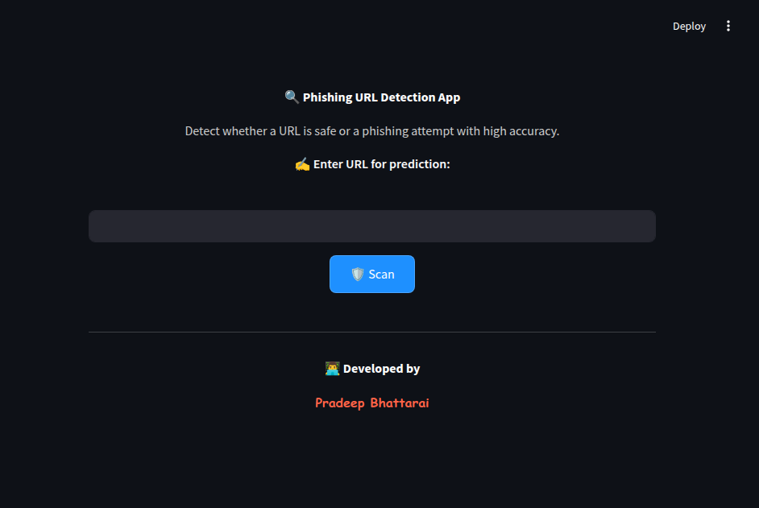
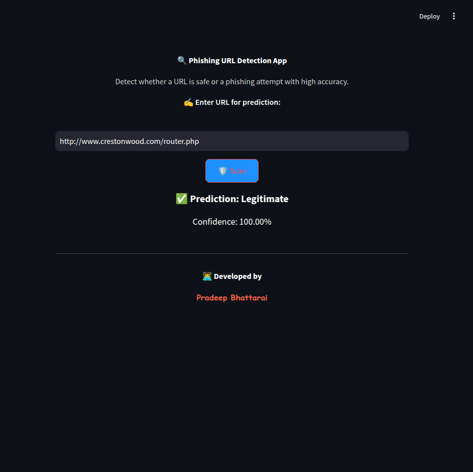
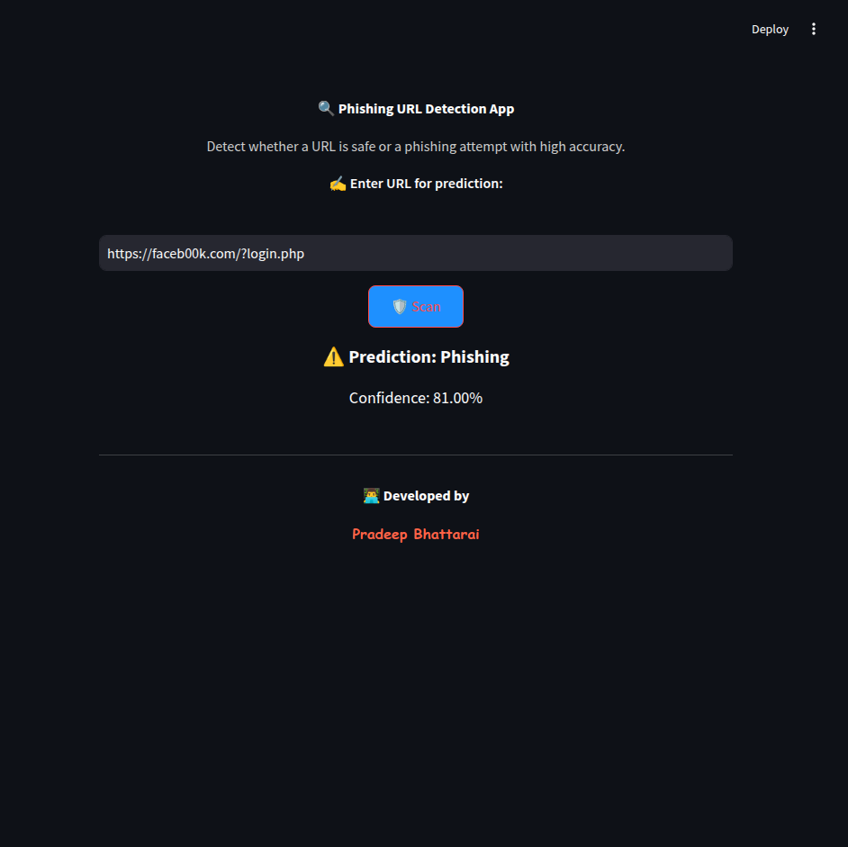

# Phishing URL Detection App

A Streamlit-based web application that detects whether a given URL is phishing or legitimate. The app first checks if the URL exists in a pre-loaded dataset and, if so, returns a 100% confidence result. If the URL is not found in the dataset, the app extracts features from the URL and uses a trained machine learning model (Random Forest) to predict whether the URL is phishing or legitimate with a confidence score.

## 1. Introduction

Phishing attacks are one of the most common cybersecurity threats, where attackers use deceptive URLs to trick users into divulging sensitive information. This project aims to build an easy-to-use web application that helps detect phishing URLs by leveraging a dataset of known phishing and legitimate URLs along with a machine learning model.

**Key Features:**
- **Dataset-based Check:** Quickly identifies known phishing or legitimate URLs from a pre-loaded dataset.
- **Model-based Prediction:** For unknown URLs, extracts features and uses a trained Random Forest model to classify the URL.
- **Confidence Scores:** Provides a confidence percentage for each prediction.
- **User-friendly Interface:** Built with Streamlit, offering a clean, modern, and visually appealing design with background images and custom styling.
- **Developer Signature:** Includes a developer credit in a stylish, cursive, autograph-like format.

## 2. How It Works

1. **Dataset Loading:**  
   The application loads a CSV dataset (`dataset_phishing.csv`) containing URLs and their labels (phishing or legitimate). It then separates the URLs into two sets:
   - **Phishing URLs Set:** Contains URLs labeled as "phishing."
   - **Legitimate URLs Set:** Contains URLs labeled as "legitimate."

2. **Model Loading:**  
   A pre-trained Random Forest model (`phishing_model.pkl`) is loaded from the specified path. This model was trained on a dataset with multiple features extracted from URLs.

3. **Prediction Process:**  
   - **Step 1:** When a user enters a URL, the app first checks whether the URL exists in the phishing or legitimate sets from the dataset.
     - If the URL is found in the phishing set, the app immediately returns "Phishing" with 100% confidence.
     - If the URL is found in the legitimate set, it returns "Legitimate" with 100% confidence.
   - **Step 2:** If the URL is not present in either set, the app extracts features from the URL (using a placeholder function; replace with actual extraction logic) and then uses the trained model to predict its classification along with a confidence score.
   
4. **User Interface:**  
   The app displays:
   - A centered input field for the URL.
   - A **"Scan"** button that triggers the prediction.
   - The prediction result (with green checkmark for legitimate URLs and a red warning for phishing URLs) and confidence percentage.
   - A custom background image and stylish developer signature.

## 3. Installation and Setup

### Prerequisites
- Python 3.7+
- Streamlit
- scikit-learn
- Pandas, NumPy
- Joblib

### Installation

## 1. Clone the Repository
git clone <repository_url>
cd phishing-url-detection-app

## 2.Install the Required Packages
pip install -r requirements.txt

## 3. Run the App
streamlit run PhishingScanner.py

## 5. Examples

### Screenshots
Here are some example screenshots of the application:

- **Home Screen:**  
  

- **Prediction Result (Legitimate):**  
  

- **Prediction Result (Phishing):**  
  

